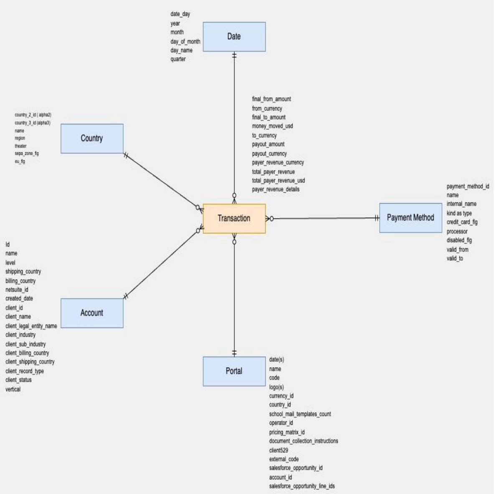
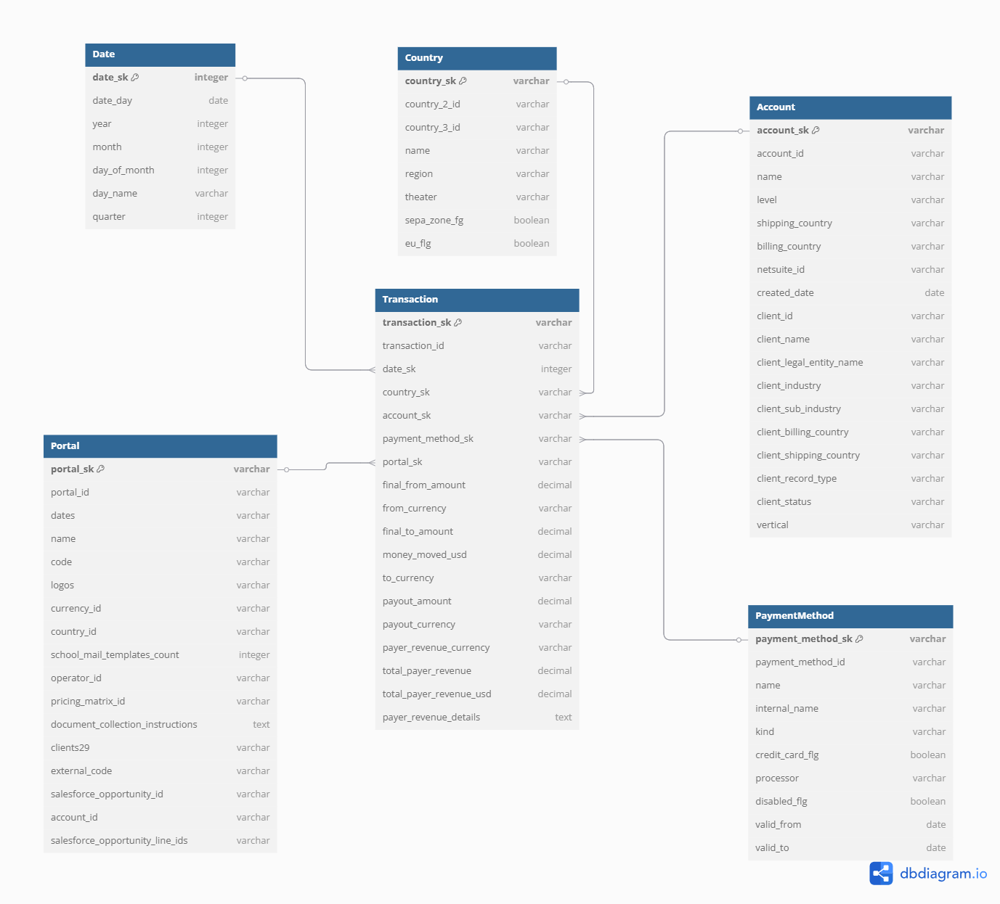

# Payment Processing Data Model Analysis
## Description of the Diagram
The following diagram represents a dimensional data model for an international payment processing system:



At its core is a Transaction entity connected to 5 dimension tables:
- Date
- Country
- Account
- Payment Method
- Portal

The Transaction table contains financial metrics (amounts, currencies, revenue fields), while the dimension tables provide contextual attributes for comprehensive analysis. The relationships shown use entity-relationship notation, indicating many-to-one connections from Transaction to each dimension.

## Data Modeling Type
This is a dimensional data model implementing a star schema design. It is characterized by a central fact table `Transaction` connected to multiple dimension tables.

This architecture is optimized for analytical processing, reporting, and business intelligence use cases. The model follows classic star schema principles with a clear separation between metrics and descriptive attributes.

## Types of Tables
The diagram shows 2 fundamental table types in dimensional modeling:

### Fact Table
Transaction: The central fact table containing quantitative measures about payment transactions like `total_payer_revenue`, `final_from_amount`, `money_moved_usd`, etc.

This fact table has a grain of 1 row per individual payment transaction processed. Each transaction record represents a single payment event with its associated amounts, currencies, and revenue metrics.

### Dimension Tables
- Date: temporal attributes 
- Country: geographic attributes 
- Account: client information
- Payment method: Payment processing attributes
- Portal: platform/channel attributes 

## Proposed Improvements
The current model lacks explicit foreign key relationships between the fact and dimension tables, as well as proper key management.

I propose enhancing the model as shown below:


[Link to the diagram](https://dbdiagram.io/d/Flywire-Payment-Processing-Data-Model-67fbf4884f7afba1846c3556)

### Surrogate Keys
Implement surrogate keys for all dimensions to improve join performance and handle changing business keys:
- Date dimension: `date_sk` using `YYYYMMDD` format
- Other dimensions: MD5 hash-based surrogate keys

### Natural Keys
Preserve business keys from source systems:
- `country_2_id` and `country_3_id` in Country dimension
- `account_id` in Account dimension
- `payment_method_id` in Payment Method dimension

### Transaction Table Enhancement:
Add both a surrogate key `transaction_sk` and a natural business key `transaction_id`, as well as foreign key references to all dimension tables.

This dual-key approach provides:
- Faster joins on integer/fixed-length surrogate keys
- Preserved natural keys for data lineage and business context
- Options for joining based on either technical or business requirements

# SQL Exercises
## Query to get total Q4 2024 revenue
```sql
SELECT 
    SUM(t.total_payer_revenue_usd) AS total_q4_2024_revenue_usd
FROM Transaction t
JOIN Date d ON t.date_sk = d.date_sk
WHERE d.year = 2024 
    AND d.quarter = 4
```

## Query to get Q4 2024 revenue by vertical

```sql
SELECT 
    a.vertical AS vertical,
    SUM(t.total_payer_revenue_usd) AS q4_2024_revenue_usd
FROM Transaction t
JOIN Date d
    ON t.date_sk = d.date_sk
JOIN Account a
    ON t.account_sk = a.account_sk
WHERE d.year = 2024 
    AND d.quarter = 4
GROUP BY a.vertical
ORDER BY q4_2024_revenue_usd DESC
```

## Query to get Q4 2024 YoY growth by vertical

```sql
-- CTE to calculate total revenue by vertical for Q4 2023
WITH q4_2023_revenue AS (
    SELECT 
        a.vertical AS vertical,
        SUM(t.total_payer_revenue_usd) AS revenue_usd
    FROM Transaction t
    JOIN Date d
        ON t.date_sk = d.date_sk
    JOIN Account a
        ON t.account_sk = a.account_sk
    WHERE d.year = 2023
        AND d.quarter = 4
    GROUP BY a.vertical
),
-- CTE to calculate total revenue by vertical for Q4 2024
q4_2024_revenue AS (
    SELECT 
        a.vertical AS vertical,
        SUM(t.total_payer_revenue_usd) AS revenue_usd
    FROM Transaction t
    JOIN Date d
        ON t.date_sk = d.date_sk
    JOIN Account a 
        ON t.account_sk = a.account_sk
    WHERE d.year = 2024
        AND d.quarter = 4
    GROUP BY a.vertical
)
-- Join both periods and calculate YoY growth
SELECT
    COALESCE(current.vertical, previous.vertical) AS vertical,
    previous.revenue_usd AS q4_2023_revenue_usd,
    current.revenue_usd AS q4_2024_revenue_usd,
    CASE
        -- -100% when vertical had revenue in 2023 but none in 2024
        WHEN current.revenue_usd IS NULL THEN -1
        -- cant calculate growth when no revenue in 2023 (new vertical)
        WHEN COALESCE(previous.revenue_usd, 0) = 0 THEN NULL
        -- YoY calculation
        ELSE ROUND((current.revenue_usd - previous.revenue_usd) / previous.revenue_usd, 2)
    END AS yoy_growth_percentage
FROM q4_2024_revenue current
FULL OUTER JOIN q4_2023_revenue previous
    ON current.vertical = previous.vertical
ORDER BY yoy_growth_percentage DESC
```

## Query to get Q4 2024 YoY growth by vertical with payment method

```sql
-- CTE to calculate total revenue by vertical and payment method for Q4 2023
WITH q4_2023_revenue AS (
    SELECT 
        a.vertical AS vertical,
        pm.name AS payment_method,
        SUM(t.total_payer_revenue_usd) AS revenue_usd
    FROM Transaction t
    JOIN Date d
        ON t.date_sk = d.date_sk
    JOIN Account a
        ON t.account_sk = a.account_sk
    JOIN PaymentMethod pm
        ON t.payment_method_sk = pm.payment_method_sk
    WHERE d.year = 2023
        AND d.quarter = 4
    GROUP BY a.vertical, pm.name
),
-- CTE to calculate total revenue by vertical and payment method for Q4 2024
q4_2024_revenue AS (
    SELECT 
        a.vertical AS vertical,
        pm.name AS payment_method,
        SUM(t.total_payer_revenue_usd) AS revenue_usd
    FROM Transaction t
    JOIN Date d
        ON t.date_sk = d.date_sk
    JOIN Account a 
        ON t.account_sk = a.account_sk
    JOIN PaymentMethod pm
        ON t.payment_method_sk = pm.payment_method_sk
    WHERE d.year = 2024
        AND d.quarter = 4
    GROUP BY a.vertical, pm.name
)

-- Join both periods and calculate YoY growth
SELECT
    COALESCE(current.vertical, previous.vertical) AS vertical,
    COALESCE(current.payment_method, previous.payment_method) AS payment_method,
    previous.revenue_usd AS q4_2023_revenue_usd,
    current.revenue_usd AS q4_2024_revenue_usd,
    CASE
        -- -100% when vertical had revenue in 2023 but none in 2024
        WHEN current.revenue_usd IS NULL THEN -1
        -- cant calculate growth when no revenue in 2023 (new vertical)
        WHEN COALESCE(previous.revenue_usd, 0) = 0 THEN NULL
        -- YoY calculation
        ELSE ROUND((current.revenue_usd - previous.revenue_usd) / previous.revenue_usd, 2)
    END AS yoy_growth_percentage
FROM q4_2024_revenue current
FULL OUTER JOIN q4_2023_revenue previous
    ON current.vertical = previous.vertical 
    AND current.payment_method = previous.payment_method
ORDER BY vertical, yoy_growth_percentage DESC
```