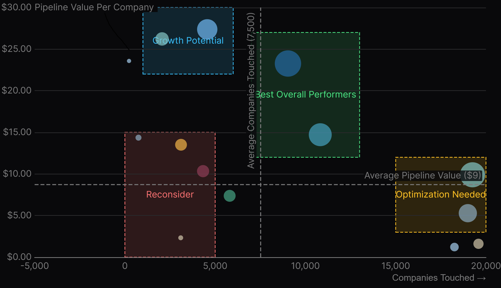
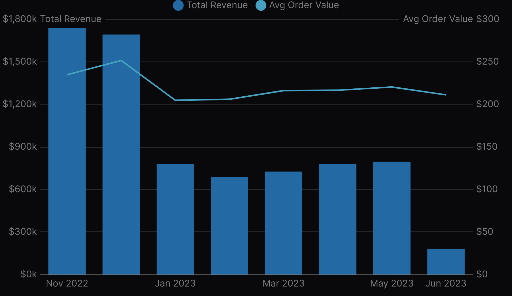
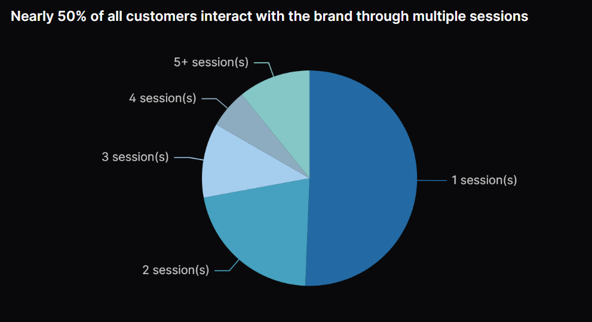
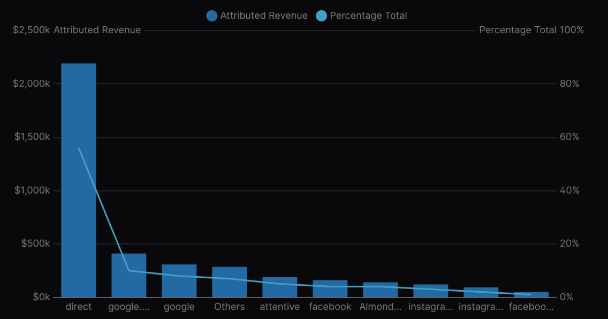

# Executive Summary
## Outbound Campaign Performance Analysis
### Key Metrics & Top Performers
Based on my analysis of  outbound campaigns, I recommend Pipeline Value per Company Touched as the Top KPI. This metric directly measures outbound efficiency in generating qualified pipeline opportunities for the sales team.

Using this metric, our top performers are:
- [Redacted]: $23.27 per company with 9,032 companies touched
- [Redacted]: $14.72 per company with 10,821 companies touched

### Outbound Opportunity Sizing
Scaling outbound efforts to the entire TAM of 127,000 Shopify merchants could generate:

- Conservative scenario: $589K in new ARR (14.0% of sales capacity)
- Moderate scenario: $870K in new ARR (20.7% of sales capacity)
- Optimistic scenario: $1.15M in new ARR (27.4% of sales capacity)

This analysis reveals a significant gap between the $7M ARR growth target and what outbound alone can realistically deliver, even in the most optimistic scenario.

### Multi-Channel Acquisition Strategy Recommendations
To bridge this gap, I recommend a balanced approach across 3 key channels:

**1. Inbound Foundation**
- Leverage client ecommerce data to create authoritative industry benchmarks
- Develop compelling case studies highlighting specific pain points and outcomes
- Amplify content through owned channels and industry publications

**2. Enhanced Outbound**
- Scale highest-performing campaigns with refined targeting
- Focus on personalization quality rather than just volume
- Integrate insights from inbound content to improve message relevance

**3. Targeted Paid Acquisition**
- Build broader market awareness through LinkedIn, YouTube, and Reddit
- Test sponsored content in industry newsletters (EcommerceFuel, 2PM, draft.nu)
- Sponsor influential industry podcasts

## Sales + Attribution Analysis for Almond Cow
### Order Analysis

Analysis of Almond Cow's orders data revealed:

- Strong seasonal pattern with peak revenue during Nov-Dec 2022 BFCM + holiday season
- Significant drop in January 2023 showing typical post-holiday slump
- AOV highest during Nov-Dec ($251) and gradually recovered through Spring 2023

### Attribution Model Selection
I implemented a U-shaped attribution model based on the finding that nearly 50% of customers interact with the brand across multiple sessions before purchasing:

This model:
- Gives 40% credit to the first touchpoint (discovery)
- Gives 40% credit to the last touchpoint (conversion)
- Distributes remaining 20% across middle touchpoints

### Channel Performance

The attribution analysis revealed:

- Direct traffic: Dominant channel accounting for 56% of attributed revenue ($2.19M)
- Google organic: Second largest at 10% ($410K)
- Google paid: Third at 8% ($308K)
- Attentive (SMS): Fourth at 5% ($188K)

The high proportion of direct traffic suggests potential UTM tagging inconsistencies across marketing campaigns, presenting an opportunity for improved tracking implementation.